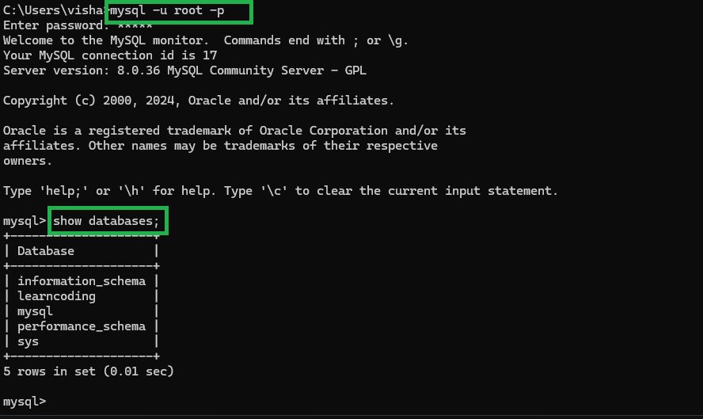

# Python to MySQL database connectivity
To handle MySQL database from python, you need to install three things:
1. Python
2. MySQL
3. MySQL Driver


### Step1: Crete Connection
```python
import mysql.Connector as myConn
mydb = myConn.connect(host="localhost",
                    user = "username",
                    password = "password",
                    database= "database_name")
print(mydb)
```

### Step2: Create Database
```python
import mysql.connector as myConn
mydb = myConn.connect(host="localhost", user = "root", password = "admin")

db_cursor = mydb.cursor() # help to execute the sql query

db_cursor.execute("""CREATE DATABASE LearnCoding""")
```

### Step3: Check if database crated
use sql using cmd: `mysql -u root -p` <br>



### Step4: Create a table in this database
```python
import mysql.connector as myConn

mydb = myConn.connect(host="localhost", user='root', password='admin', database='Learncoding')

db_cursor = mydb.cursor()

db_cursor.execute("""CREATE TABLE Emp(
                  Roll int,
                  Ename varchar(20))""")

print("Table Created!!")
```

### Step5: Insert a record
```python
import mysql.connector as myConn

mydb = myConn.connect(host="localhost", user='root', password='admin', database='Learncoding')
db_cursor = mydb.cursor()

db_query = """INSERT INTO emp(Roll, Ename) values(%s, %s)"""
record_list = [(30, "Vishal"), (40, "Kumar"), (50,"Rohit")]

db_cursor.executemany(db_query, record_list)
mydb.commit()

print(db_cursor.rowcount, "record inserted")
```

### Step6: Select statment
```python
import mysql.connector as myConn

mydb = myConn.connect(host="localhost", user='root', password='admin', database='Learncoding')
db_cursor = mydb.cursor()

db_query = """SELECT * FROM Learncoding.emp"""
db_cursor.execute(db_query)

for row in db_cursor.fetchall():
    print(row)
```

### Step7: Update Record
```python
import mysql.connector as myConn

my_db = myConn.connect(host="localhost", user='root', password='admin', database='Learncoding')
db_cursor = my_db.cursor()

db_query = """UPDATE Learncoding.emp SET Ename=%s WHERE Ename=%s"""
db_value = ("Chikku", "Vishal")
db_cursor.execute(db_query, db_value)

my_db.commit()
print(db_cursor.rowcount, "data updated")
```

### Step8: Delete Record
```python
import mysql.connector as myConn

my_db = myConn.connect(host="localhost", user="root", password="admin", database="Learncoding")
db_cursor = my_db.cursor()

my_query = """ DELETE FROM Learncoding.emp WHERE Ename=%s """
my_value = ("Rohit", )

db_cursor.execute(my_query, my_value)
my_db.commit()

print(db_cursor.rowcount, "Record Deleted!!!")
```

### Step9: Delete all record on database.
```python
import mysql.connector as myConn

my_db = myConn.connect(host="localhost", user="root", password="admin", database="Learncoding")
db_cursor = my_db.cursor()

my_query = """ TRUNCATE TABLE Learncoding.emp """

db_cursor.execute(my_query)
my_db.commit()

print("All Record Deleted!!!")
```