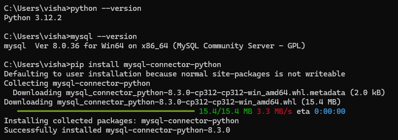

# Python to MySQL database connectivity
To handle MySQL database from python, you need to install three things:
1. Python
2. MySQL
3. MySQL Driver


### Step1: Crete Connection
    ```python
    import mysql.Connector as myConn
    mydb = myConn.connect(host="localhost",
                        user = "username",
                        password = "password",
                        database= "database_name")
    print(mydb)
    ```

### Step2: Create Database